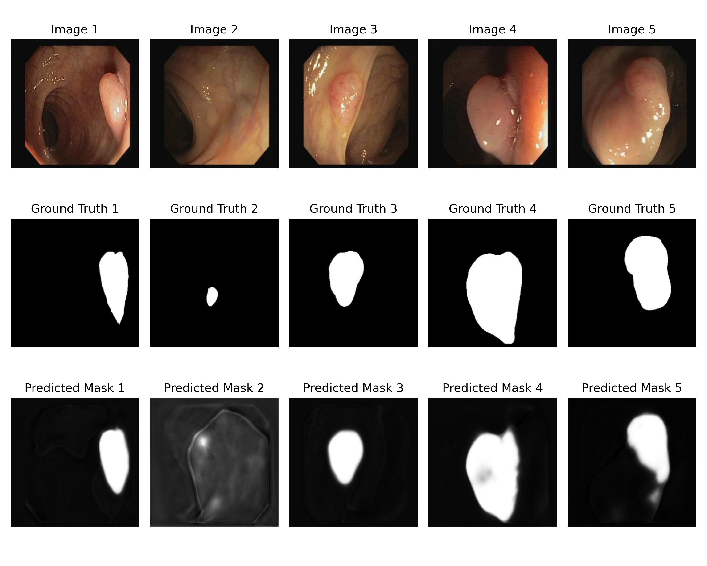
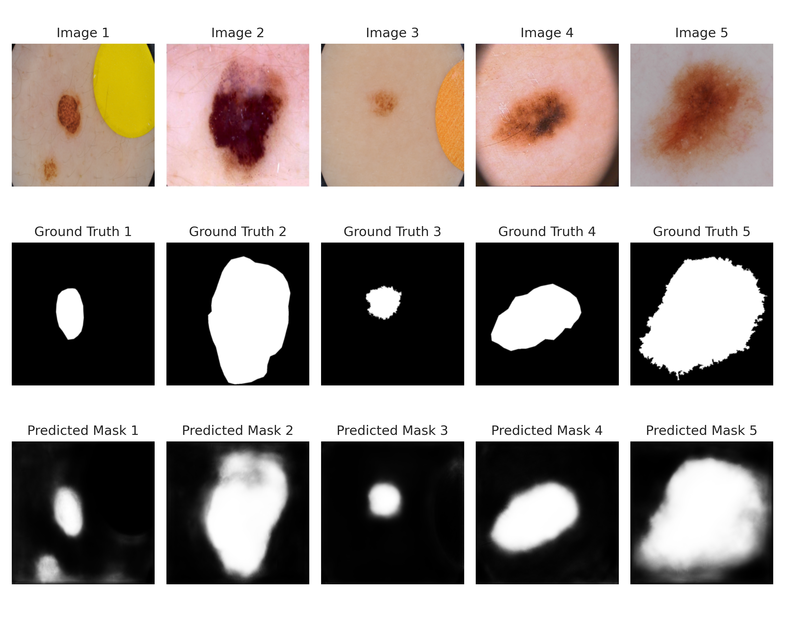
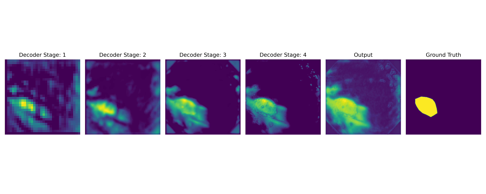

# 🧠 MLAT-Net: A Novel Hybrid Version of Multilevel Attention with Transformer for Medical Image Segmentation

> **Author:** Pratik Pal
> **Degree:** M.Tech in Computer & Systems Sciences
> **Institution:** Jawaharlal Nehru University (JNU), New Delhi, India
> **Supervisor:** Dr. Sachin B. Jadhav
> 📧 Email: [pratik25_scs@jnu.ac.in](mailto:pratik25_scs@jnu.ac.in)

---

## 🔍 Project Overview

**MLAT-Net** is a hybrid deep learning architecture combining **U-Net-style CNN encoders** with **Transformer-based self-attention modules**. It is designed for **robust and generalizable medical image segmentation**, capable of capturing both **long-range dependencies** and **fine-grained spatial features**.

The network has been validated on **ISIC-2018**, **Kvasir-SEG**, and **CVC-ClinicDB**, segmenting polyps, lesions, and critical regions across dermoscopy, endoscopy, and colonoscopy images.

---

## 🧠 Architecture: MLAT-Net

MLAT-Net follows an **encoder-decoder backbone** with enhanced multi-level attention.

### 🔧 Key Components

* **Self-Aware Attention (SAA) Module**

  * 🌐 **Transformer Self-Attention (TSA):** Captures global semantic context
  * 🧭 **Global Spatial Attention (GSA):** Enhances spatial relationships

* **Multi-Scale Dense Skip Connections**
  Combines features across resolutions for improved boundary segmentation.

* **Double Ablation Design**

  * Pooling: `Max` vs `Average`
  * Optimizers: `Adam`, `RMSProp`, `Adagrad`, `SGD`

### 🧬 Input / Output

* **Input:** `(256 × 256 × 3)` RGB medical image

* **Output:** `(256 × 256 × 1)` binary segmentation mask

* **Decoder Feature Maps:** Captured at each upsampling stage for visualization and analysis

---

## 🧪 Datasets Used

| Dataset      | Modality    | Images | Task                             |
| ------------ | ----------- | ------ | -------------------------------- |
| ISIC-2018    | Dermoscopy  | 2,596  | Skin lesion segmentation         |
| Kvasir-SEG   | Endoscopy   | 1,000  | Gastrointestinal polyp detection |
| CVC-ClinicDB | Colonoscopy | 612    | Polyp detection                  |

---

## 📈 Results Summary

### Multi-Split Validation (80:20, 70:30, 60:40)

| Dataset      | Optimizer | Dice (mean ± std) | IoU (mean ± std) | Notes                                        |
| ------------ | --------- | ----------------- | ---------------- | -------------------------------------------- |
| ISIC-2018    | Adam      | 0.910 ± 0.006     | 0.840 ± 0.008    | Best performance on skin lesion segmentation |
| Kvasir-SEG   | Adam      | 0.790 ± 0.007     | 0.660 ± 0.009    | Stable generalization                        |
| CVC-ClinicDB | RMSProp   | 0.900 ± 0.005     | 0.820 ± 0.006    | Robust boundary detection                    |

📌 MLAT-Net consistently outperforms baseline models (U-Net, Attention U-Net, TransUNet) across **Dice**, **IoU**, and **Recall**, with superior generalization across modalities.

---

## 🧪 Experimental Setup

* **Input Resolution:** 256 × 256
* **Batch Size:** 16 (scaled for multi-GPU)
* **Train/Test Splits:** 80:20, 70:30, 60:40
* **Epochs:** 50
* **Learning Rate:** 0.001 (step decay ×0.5 every 20 epochs)
* **Hardware:** Tesla T4 / A100 GPUs

### ⚙️ Optimizers Evaluated

| Optimizer | Momentum / Betas |
| --------- | ---------------- |
| Adam      | β₁=0.9, β₂=0.999 |
| RMSProp   | 0.95             |
| Adagrad   | -                |
| SGD       | 0.85 / 0.95      |

---

## 📊 Comparative Evaluation with SOTA

| Model        | Dataset      | Dice (%) | IoU (%) | Accuracy (%) | Recall (%) | Precision (%) |
| ------------ | ------------ | -------- | ------- | ------------ | ---------- | ------------- |
| **MLAT-Net** | ISIC-2018    | 90.78    | 64.10   | 94.89        | 87.89      | 93.63         |
| DoubleU-Net  | ISIC-2018    | 89.62    | 82.12   | 93.87        | 87.00      | 94.59         |
| ResUNet++    | Kvasir-SEG   | 79.97    | 79.56   | 94.57        | 70.83      | 94.64         |
| TransUNet    | CVC-ClinicDB | 93.50    | 88.70   | -            | -          | -             |
| **MLAT-Net** | CVC-ClinicDB | 86.88    | 77.23   | 97.77        | 83.66      | 90.78         |

---

## 🌐 Visual Results

### Example Predictions

### Decoder Feature Maps Across Stages

📌 Feature maps illustrate how MLAT-Net captures **progressively refined semantic and spatial information** at each decoder stage.

---

## 🔍 Limitations & Future Work

* 🐢 High computational cost due to multi-level attention
* 🔄 Rare channel mismatches in decoder
* ⚙️ Not yet optimized for 3D medical imaging

### 🚀 Future Enhancements

* Incorporate **skip-attention** and **adaptive encoding**
* Extend to **volumetric (3D) imaging** like MRI and CT
* Optimize for **real-time clinical inference**

---

## 📚 References

* [TransUNet: arXiv:2102.04306](https://arxiv.org/abs/2102.04306)
* [DoubleU-Net](https://doi.org/10.1109/CBMS49503.2020.00111)
* [ISIC-2018 Dataset](https://arxiv.org/abs/1902.03368)
* [Kvasir-SEG Dataset](https://doi.org/10.1007/978-3-030-37734-2_37)
* [CVC-ClinicDB Dataset](https://doi.org/10.1016/j.media.2013.03.001)
